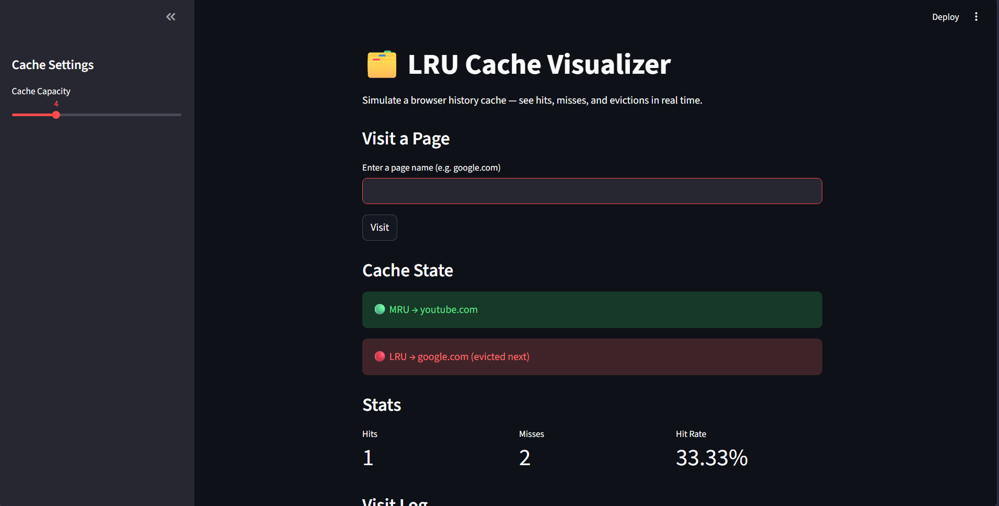
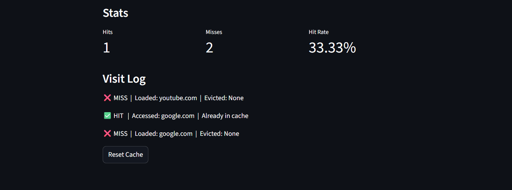
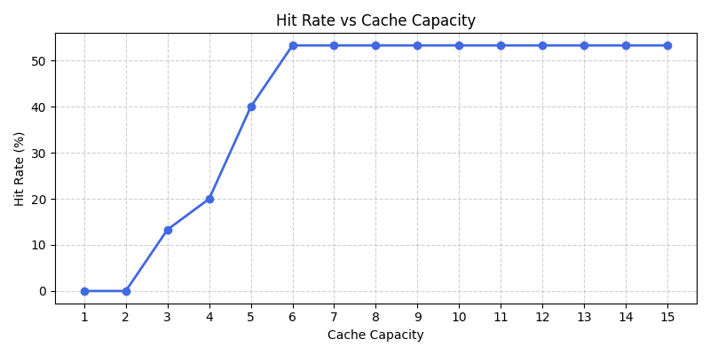
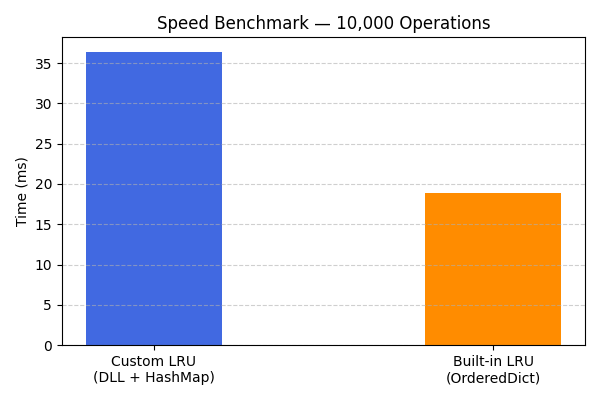

markdown# LRU Cache — From Scratch in Python

A fully functional LRU (Least Recently Used) Cache built from scratch in Python using a **Doubly Linked List + HashMap** approach. The project is structured in 4 layers — core DSA, simulation, visualization, and analysis.

---

## What is an LRU Cache?

An LRU Cache is a data structure that stores a fixed number of items and evicts the **least recently used** item when it reaches capacity. It is widely used in operating systems, browsers, and databases to speed up repeated data access.

---

## Project Structure
lru-cache-project/
├── node.py                   # Node class for doubly linked list
├── doubly_linked_list.py     # Doubly linked list with insert and remove
├── lru_cache.py              # LRU Cache class (core logic)
├── main.py                   # Quick test for core layer
├── simulation.py             # Browser cache simulation
├── app.py                    # Streamlit visual UI
├── analysis.py               # Hit rate and speed benchmark plots

---

## Layers

**Layer 1 — Core DSA**
LRU Cache built using a doubly linked list for order tracking and a hashmap for O(1) lookup. Both `get` and `put` run in **O(1)** time.

**Layer 2 — Simulation**
Simulates a browser history cache over a sequence of 15 page visits. Logs every hit, miss, and eviction with a summary at the end.

**Layer 3 — Visualization**
A Streamlit web app where you can visit pages one by one and watch the cache state update in real time — showing MRU, LRU, hits, misses, and evictions live.

**Layer 4 — Analysis**
Two matplotlib plots:
- Hit Rate vs Cache Capacity — shows the optimal capacity sweet spot
- Speed Benchmark — compares custom LRU vs Python's built-in OrderedDict LRU over 10,000 operations

---

## Time Complexity

| Operation | Time Complexity |
|-----------|----------------|
| get(key)  | O(1)           |
| put(key)  | O(1)           |
| Eviction  | O(1)           |

---

## How to Run

**Install dependencies**
pip install streamlit matplotlib

**Test core layer**
python main.py

**Run simulation**
python simulation.py

**Launch visual UI**
streamlit run app.py

**Run analysis**
python analysis.py

---

## Key Insights from Analysis

- Hit rate rises steeply from capacity 1 to 6, then flattens completely — the entire visit sequence fits in cache at capacity 6, making further increases redundant
- Custom LRU (~36ms) is slower than built-in OrderedDict LRU (~19ms) over 10,000 operations — both are O(1), but OrderedDict is implemented in C under the hood while this implementation is pure Python

---

## Screenshots

### Streamlit UI

### Hit Rate vs Capacity

### Speed Benchmark
